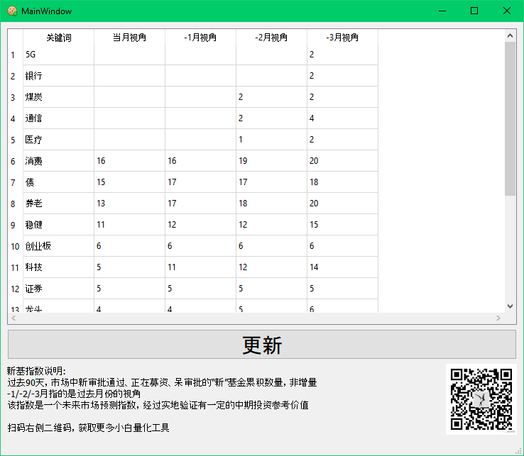

# 心机指数
fundindice.py

可以抓取过去半年新成立基金的统计情况，该指标有一定的前瞻性，我自己试用效果不错，自取验证参考。

2020年4月份第一次跑结果，随重仓了消费、创业板、科技和医疗；6月底意外牛市，运气八错。

## 该工具的原理
1. 新发基金代表了基金行业精英们的趋势判断
1. 该判断落实一定会落实为基金仓位
1. 如果趋势成立，基金公司会优先发新基金（原因不便说明）
1. 可以用来推断90天-180天的新建基金情况，周期基本符合审批、建仓时间，可以认为是一个“抬轿指数”
1. 该数据有较大概率盈利参考

## 如何使用
1. 数据趋势很粗糙，不能用于量化，只能判断方向
1. 比较过去4个月视角的数据，如果持续增加且维持较高数字，则为未来趋势
1. 新型基金或者冷门等数据不会很多，所以不能否定他们不行，但不是该工具要提供的功能
1. 医疗、医药、养老可以合并来看；科技、通信、人工智能等可以合并来看，其他关联行业雷同
1. 方向只能选取前三个，其他可信度下降
1. 选取头三名，数据稳定或者持续增加的，建仓即可

关于这个工具的[雪球记录](https://xueqiu.com/6140812995/146453858)

## 捐助
如果你对这个工具感兴趣，可以捐助我喝杯咖啡哦

